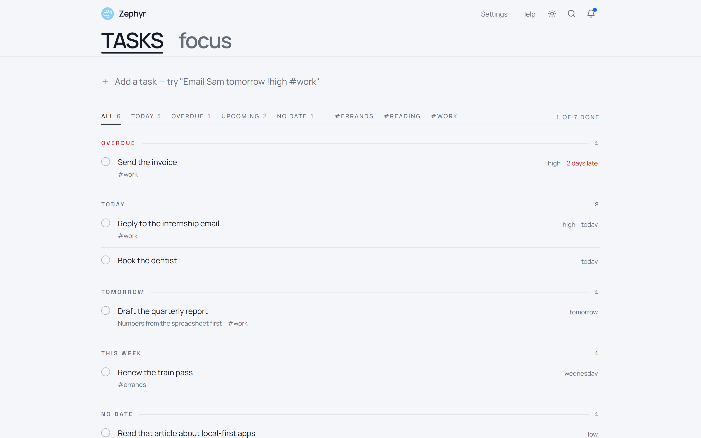

<div align="center">


# Zephyr

### Flow Through Focus

A free, **local-first** productivity app — tasks, notes, and a Pomodoro focus timer.
No login, no signup, no backend. Your data never leaves your browser.

[](https://github.com/dominikkoenitzer/Zephyr/actions/workflows/ci.yml)
[](https://zephyr.punds.ch)
[](https://zephyr.punds.ch)


**[→ Try it live at zephyr.punds.ch](https://zephyr.punds.ch)**




</div>

---

## Table of contents

- [Why Zephyr](#why-zephyr)
- [Features](#features)
- [Natural-language quick add](#natural-language-quick-add)
- [Focus presets](#focus-presets)
- [Tech stack](#tech-stack)
- [Getting started](#getting-started)
- [Scripts](#scripts)
- [Project structure](#project-structure)
- [Architecture](#architecture)
- [Privacy](#privacy)
- [Deployment & CI/CD](#deployment--cicd)
- [Contributing](#contributing)
- [Author](#author)

## Why Zephyr

Most productivity apps want an account, a subscription, and a copy of your data on their servers. Zephyr wants none of that.

- **Local-first** — every task, note, and focus session lives in your browser's `localStorage`. Nothing is ever uploaded.
- **No login** — open the app and start. There is no sign-up flow because there is no server.
- **Works offline** — Zephyr is an installable Progressive Web App (PWA). Install it and it keeps working without a connection.
- **Fast & distraction-free** — a clean, keyboard-friendly interface with light and dark themes.

## Features

| | Feature | What it does |
|---|---|---|
| ✅ | **Tasks** | Due dates, priorities, and `#tags`. [Natural-language quick add](#natural-language-quick-add) understands plain English as you type. |
| ⏱️ | **Focus Timer** | A Pomodoro timer with four built-in [presets](#focus-presets) (plus your own), fully customizable durations, automatic session tracking, and a day-streak counter. |
| 📝 | **Notes** | Quick capture with `#tags`, eight accent colors, pinning, and instant search. Plain-text and friction-free. |
| 🏠 | **Home dashboard** | A weekly overview — active tasks, tasks completed this week, focus minutes, total notes — plus what's due today. |
| 🔎 | **Unified search** | Press <kbd>Ctrl</kbd>/<kbd>Cmd</kbd> + <kbd>K</kbd> to search across tasks and notes from anywhere. |
| 🔔 | **Notifications** | Optional in-app reminders for upcoming due dates, plus a chime when a focus session ends. All toggleable. |
| 🌗 | **Light & dark themes** | A theme toggle in the sidebar; your preference is remembered. |

## Natural-language quick add

Type a task the way you'd say it and Zephyr extracts the structure for you — locally, with no AI or network calls. A live preview shows what it detected before you hit enter.

```
Email Sam tomorrow !high #work
```

→ **Email Sam**, due tomorrow, high priority, tagged `work`.

| Token | Examples | Becomes |
|---|---|---|
| **Date** | `today`, `tonight`, `tomorrow`, `next monday`, `friday`, `in 3 days`, `aug 5`, `12/25`, `2026-08-05` | Due date |
| **Priority** | `!high` · `!med` · `!low` (also `!h`/`!m`/`!l`, `!1`/`!2`/`!3`, `p1`/`p2`/`p3`) | Priority |
| **Tag** | `#work`, `#family` | Tags (lowercased, de-duplicated) |

## Focus presets

| Preset | Focus | Short break | Long break | Sessions until long break |
|---|---|---|---|---|
| **Pomodoro** | 25 min | 5 min | 15 min | 4 |
| **Short Focus** | 15 min | 3 min | 10 min | 4 |
| **Deep Work** | 45 min | 10 min | 20 min | 3 |
| **Meditation** | 10 min | 2 min | 5 min | 3 |

Every duration is adjustable, and you can save your own custom presets. Completed work sessions are tracked automatically so you can build a consistent daily streak.

## Tech stack

- **[React 18](https://react.dev/)** + **[Vite 6](https://vite.dev/)** (via `@vitejs/plugin-react-swc`)
- **[React Router v6](https://reactrouter.com/)** with lazy-loaded routes
- **[Tailwind CSS 3](https://tailwindcss.com/)** + **[Radix UI](https://www.radix-ui.com/)** primitives (shadcn-style)
- **[Motion](https://motion.dev/)** for animations (page transitions, layout animations, micro-interactions — respects reduced-motion)
- **[ogl](https://github.com/oframe/ogl)** for the WebGL aurora backdrop (lazy-loaded, theme-aware, disabled under reduced-motion)
- **[lucide-react](https://lucide.dev/)** icons · **[sonner](https://sonner.emilkowal.ski/)** toasts
- **[Vitest](https://vitest.dev/)** + jsdom for unit tests
- **[Bun](https://bun.sh/)** as the runtime, package manager, and script runner
- **[Vercel](https://vercel.com/)** hosting + `@vercel/analytics`
- **No backend** — state lives in the browser via `localStorage`

## Getting started

**Prerequisites:** [Bun](https://bun.sh/) 1.1.39+ (this repo pins `1.3.14` via `.bun-version`). Bun is the runtime and package manager — no separate Node.js install is required.

```bash
# Clone
git clone https://github.com/dominikkoenitzer/Zephyr.git
cd Zephyr

# Install dependencies
bun install

# Start the dev server → http://localhost:1000
bun run dev
```

That's it — no `.env`, no database, no API keys.

## Scripts

| Command | Description |
|---|---|
| `bun run dev` | Start the Vite dev server on [http://localhost:1000](http://localhost:1000) |
| `bun run build` | Production build to `dist/` |
| `bun run preview` | Serve the production build locally |
| `bun run lint` | Run ESLint (`--max-warnings 0` — warnings fail) |
| `bun run test` | Run the Vitest unit suite |

## Project structure

```
src/
├── app/            # AppLayout — the sidebar + header shell
├── components/
│   ├── FocusTimer/ # Pomodoro timer
│   ├── Notes/      # Notes
│   ├── Search/     # Cmd/Ctrl+K search
│   ├── TaskManager/# Tasks & quick add
│   ├── Layout/     # Sidebar, Header, PageHeader
│   └── ui/         # Reusable shadcn-style primitives
├── hooks/          # useStore (reactive data hooks), useSEO
├── lib/            # quickParse (NL parser), utils
├── pages/          # Route-level screens
├── routes/         # routes.jsx (lazy-loaded route table)
└── services/       # localStorage, search, notification, theme (singletons)
```

## Architecture

Zephyr has no Redux, Zustand, or Context store. Application state lives in **singleton service classes** under `src/services/`, each persisting to `localStorage` (all keys prefixed `zephyr_`):

- **`localStorage.js`** — the canonical data store for tasks, notes, focus sessions, the streak, and settings. It owns the schema and the add/update/delete helpers.
- **`searchService.js`** — unified search across notes and tasks (wired into <kbd>Cmd</kbd>/<kbd>Ctrl</kbd> + <kbd>K</kbd>).
- **`notificationService.js`** — polls for task due dates and plays a Web Audio chime.
- **`themeService.js`** — light/dark via a class on `<html>`, applied before React renders to avoid a flash.

Every write broadcasts a `zephyr:change` event. Reactive hooks in **`src/hooks/useStore.js`** (`useTasks`, `useNotes`, …) subscribe to it — plus the native `storage` event for cross-tab sync — so views update live without a global store. Routes are defined in `src/routes/routes.jsx`, lazy-loaded, and wrapped in a Suspense loader.

## Privacy

Zephyr is built around a simple promise: **your data is yours and stays on your device.**

- All content is stored in your browser's `localStorage`. There is no server, no account, and no telemetry of your content.
- Because data is local, there's no automatic cloud backup — but you can **export a full backup file** (and import it on any device) from **Settings → Data Management**. Clearing your browser data (or using **Clear All Local Storage**) removes everything permanently.

## Deployment & CI/CD

Zephyr is a static SPA deployed on **[Vercel](https://vercel.com/)** (live at **[zephyr.punds.ch](https://zephyr.punds.ch)**). SPA rewrites and security/cache headers are configured in [`vercel.json`](vercel.json).

Two GitHub Actions workflows are included:

- **[`ci.yml`](.github/workflows/ci.yml)** — on every push and pull request to `main`: install, **lint**, **test**, and **build**.
- **[`deploy.yml`](.github/workflows/deploy.yml)** — optional production deploy via the Vercel CLI on push to `main`. It runs only when the `VERCEL_TOKEN`, `VERCEL_ORG_ID`, and `VERCEL_PROJECT_ID` repository secrets are set; otherwise it's a no-op (by default, Vercel's Git integration handles deploys automatically).

[Dependabot](.github/dependabot.yml) keeps npm and GitHub Actions dependencies up to date weekly.

## Contributing

Issues and pull requests are welcome. Before opening a PR:

```bash
bun run lint    # must pass with zero warnings
bun run test
bun run build
```

Please keep features minimal and aligned with the local-first, no-backend design.

## Author

**dominikkoenitzer** — software engineer in Zürich, Switzerland.

[dk.punds.ch](https://dk.punds.ch) · [CV](https://dk.punds.ch/cv) · [@dominikkoenitzer](https://github.com/dominikkoenitzer) · [dominikkoenitzer@users.noreply.github.com](mailto:dominikkoenitzer@users.noreply.github.com)

<div align="center">

⭐ If Zephyr helps you focus, consider starring the repo.

</div>
